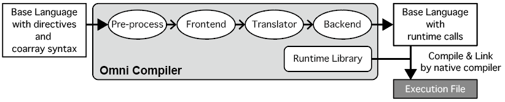

=========================
How to install
=========================

Introduction
=========================
You can install Omni Compiler by using the general installation method on UNIX ( ``./configure; make; make install`` ).

When executing ``./configure`` without options, only XcalableMP is installed. 
If you want to install XcalableACC and OpenACC, 
you need to add options to ``./configure`` 
:ref:`general` and :ref:`supercomputer` explain how to install XcalableMP. 
:ref:`optional` explains how to install XcalableACC and OpenACC. 

Get Omni Compiler package
===========================
There are two ways to get Omni Compiler from our official site or GitHub.

Official site
----------------
You can get it from http://omni-compiler.org , where provides Stable package and Nightly Build package.
The Nightly Build version is generated every midnight around 0 o'clock (Japan time) when the latest repository on GitHub has been updated from the previous day.

GitHub
--------

.. code-block:: bash

  $ git clone --recursive https://github.com/omni-compiler/omni-compiler.git

Software dependencies
===========================
Before you start to install Omni Compiler, the following software must be installed. 

* Yacc
* Lex
* C Compiler (supports C90)
* Fortran Compiler (supports Fortran 90)
* C++ Compiler
* Java Compiler
* MPI Implementation (supports MPI-2 or over)
* libxml2
* make

The following shows the procedure for installing software in major Linux distributions. 

* Debian GNU/Linux 9.0

.. code-block:: bash

    $ sudo aptitude install flex gcc gfortran g++ openjdk-8-jdk libopenmpi-dev openmpi-bin libxml2-dev byacc make perl

* Ubuntu 15.10

.. code-block:: bash

    $ sudo apt-get install flex gcc gfortran g++ openjdk-7-jdk libopenmpi-dev openmpi-bin libxml2-dev byacc make perl

* CentOS 7.2

.. code-block:: bash

    $ sudo yum install flex gcc gfortran gcc-c++ java-1.7.0-openjdk-devel openmpi-devel libxml2-devel byacc make perl

.. _general:

General instructions
=========================
This section explains how to install Omni Compiler in a general Unix environment.

Build and Install
--------------------

.. code-block:: bash

    $ ./configure --prefix=(INSTALL PATH)
    $ make
    $ make install

``(INSTALL PATH)`` indicates the place where Omni Compiler is installed.

.. note::

    ``(INSTALL PATH)`` can not be set to a directory of source code of Omni Compiler.

Set PATH
--------------------
* bash and zsh

.. code-block:: bash

    $ export PATH=(INSTALL PATH)/bin:$PATH

* csh and tcsh

.. code-block:: csh

    % setenv PATH (INSTALL PATH)/bin:$PATH

.. _supercomputer:

Each supercomputers
==================================================
When you add an option ``--target=(machine name)`` to ``./configure``,
you can build Omni Compiler that is suitable for the following specific architectures. 

The K computer
----------------------------------------

.. code-block:: bash

    $ ./configure --target=Kcomputer-linux-gnu --prefix=(INSTALL PATH)
    $ make
    $ make install

Fujitsu FX100
----------------------------------------

.. code-block:: bash

    $ ./configure --target=FX100-linux-gnu --prefix=(INSTALL PATH)
    $ make
    $ make install

If you use "MPI Version 3" instead of "Fujitsu MPI Extended RDMA" for one-sided communication features, you add ``--disable-fjrdma`` to ``./configure``.

.. code-block:: bash

    $ ./configure --target=FX100-linux-gnu --disable-fjrdma --prefix=(INSTALL PATH)

Fujitsu FX10
--------------------

.. code-block:: bash

    $ ./configure --target=FX10-linux-gnu --prefix=(INSTALL PATH)
    $ make
    $ make install

Intel Knights Landing
----------------------------------------

.. code-block:: bash

    $ ./configure --target=KNL-linux-gnu --prefix=(INSTALL PATH)
    $ make
    $ make install

Intel Knights Corner
----------------------------------------

.. code-block:: bash

    $ ./configure --target=KNC-linux-gnu --prefix=(INSTALL PATH)
    $ make
    $ make install

NEC SX-ACE
--------------------
If a login node does not have ``libxml2``, you need to install `libxml2 <http://www.xmlsoft.org/>`_.

.. code-block:: bash

    $ tar xfz libxml2-git-snapshot.tar.gz
    $ cd libxml2-2.9.2
    $ ./configure --without-python --prefix=(LIBXML2 PATH) 
    $ make
    $ make install

Next, you install Omni Compiler. 

.. code-block:: bash

    $ ./configure --target=sxace-nec-superux --with-libxml2=(LIBXML2 PATH) --prefix=(INSTALL PATH)
    $ make
    $ make install

NEC SX9
--------------------
.. code-block:: bash

    $ ./configure --target=sx9-nec-superux --prefix=(INSTALL PATH)
    $ make
    $ make install

HITACHI SR16000
--------------------
.. code-block:: bash

    $ bash
    $ export PATH=/opt/freeware/bin/:$PATH
    $ export PATH=/usr/java6/jre/bin/:$PATH
    $ bash ./configure --target=powerpc-hitachi-aix --prefix=(INSTALL PATH)
    $ make
    $ make install

IBM BlueGene/Q
--------------------
If a login node does not have ``Java``, you need to install ``Java``.
For example, 
you can get openjdk1.7.0-ppc-aix-port-linux-ppc64-b**.tar.bz2" from `the OpenJDK website <http://cr.openjdk.java.net/~simonis/ppc-aix-port/>`_.

.. code-block:: bash

    $ ./configure --target=powerpc-ibm-cnk --prefix=(INSTALL PATH)
    $ make
    $ make install

.. _optional:

Optional instructions
=========================

How to install OpenACC
----------------------------------------
You add ``--enable-openacc`` to ``./configure``.
If you need, you also add install PATH of cuda by ``--with-cuda=(CUDA PATH)``.

.. code-block:: bash

    $ ./configure --enable-openacc --with-cuda=(CUDA PATH) 
    $ make
    $ make install

It may be possible to generate a more suitable runtime library by setting options for the ``nvcc`` command, 
which is used to generate the runtime library for OpenACC. 
In that case, you can add the ``--with-gpu-cflags="(NVCC CFLAGS)"`` option to ``./configure``.

.. code-block:: bash

    $ ./configure --enable-openacc --with-cuda=(CUDA PATH) --with-gpu-cflags="-arch=sm_20 -O3"

How to install XcalableACC
----------------------------------------
You add ``--enable-openacc --enable-xacc`` to ``./configure``.
As with OpenACC, you can add the ``--with-cuda=(CUDA PATH)`` and ``--with-gpu-cflags="(NVCC CFLAGS)"`` options to ``./configure``.

.. code-block:: bash

    $ ./configure --enable-openacc --enable-xacc --with-cuda=(CUDA PATH) 
    $ make
    $ make install

Use of PGI compiler
------------------------
You specify ``--with-cuda=(CUDA PATH)`` that is included in PGI compiler.
Moreover, CUDA provided by NVIDIA is also needed to build Omni Compiler.

For example, when PGI Community Edition 16.10 is installed in /opt/pgi-1610 and CUDA 7.5 provided by NVIDIA is installed in /opt/cuda-7.5,
you can do setting as following.

.. code-block:: bash

    $ export PATH=/opt/cuda-7.5/bin:$PATH
    $ which nvcc
    $ /opt/cuda-7.5/bin/nvcc
    $ ./configure --enable-openacc --enable-xacc --with-cuda=/opt/pgi-1610/linux86-64/2016/cuda/7.5/
    $ make
    $ make install

Use of onesided library on XcalableMP
------------------------------------------------------------
You may generate a better runtime library by using MPI and a onesided library on XcalableMP.
Omni Compiler supports the following onesided libraries. 

* Fujitsu MPI Extended RDMA
* `GASNet <https://gasnet.lbl.gov/>`_
* MPI Version 3

Fujitsu MPI Extended RDMA
^^^^^^^^^^^^^^^^^^^^^^^^^^
Fujitsu MPI Extended RDMA is available only on the K computer, FX100, and FX10. 
By using ``./configure --target=(machine name)``, Omni Compiler automatically uses Fujitsu MPI Extended RDMA. 

GASNet
^^^^^^^^^^^^^^^^^^
GASNet is a onesided communication library developed at U.C. Berkeley.
If you want to use GASNet, you should add **"install path of GASNet"** and **"its conduit"** to ``./configure``.

.. code-block:: bash

    $ ./configure --with-gasnet=(GASNET PATH) --with-gasnet-conduit=(GASNET CONDUIT)

When you omit ``--with-gasnet-conduit=(GASNET CONDUIT)``, Omni Compiler automatically selects an available conduit. 

MPI Version 3
^^^^^^^^^^^^^^^^^^
Omni Compiler automatically selects MPI Version 3 under the following conditions. 

* Using MPI implementation supports MPI Version 3
* Not using GASNet 
* Except for the K computer, FX100, and FX10

How to confirm onesided library
^^^^^^^^^^^^^^^^^^^^^^^^^^^^^^^^^^^^
You can confirm which onesided communication library Omni Compiler used in the last output of ``./configure``.

* Fujitsu MPI Extended RDMA

.. code-block:: bash

    Onesided                       : yes
      Communication Library        : Fujitsu RDMA

* GASNet

.. code-block:: bash

    Onesided                       : yes
      Communication Library        : GASNet

* MPI Version 3

.. code-block:: bash

    Onesided                       : yes
      Communication Library        : MPI3

* Not use onesided library

.. code-block:: bash

    Onesided                       : no

How to indicate compiler used by Omni Compiler
-----------------------------------------------
The compiler used by Omni Compiler can be classified into two types by the location of its binary. 

* **Local compiler** is used in the Pre-process, Frontend, Translator, and Backend processes. A binary generated by a local compiler is used on the machine where you build Omni Compiler, for example, the login node of a cluster system. 
* **Native compiler** is used to generate an execution file and runtime library of Omni Compiler. A binary generated by a native compiler is used on the machine where you carry out calculations, for example, the compute node of a cluster system. 

Even though Omni Compiler automatically selects the above compilers when executing ``./configure``, 
you can select them by using the following variables. 

* Local compiler

+------------+---------------------------+
| Variable   |  Description              |
+============+===========================+
| CC         | C compiler                |
+------------+---------------------------+
| CFLAGS     | C compiler flags          |
+------------+---------------------------+
| FC         | Fortran compiler          |
+------------+---------------------------+
| FCFLAGS    | Fortran compiler flags    |
+------------+---------------------------+
| JAVA       | Java application launcher |
+------------+---------------------------+
| JAVAC      | Java compiler             |
+------------+---------------------------+
| JAR        | Java Archive Tool         |
+------------+---------------------------+

* Native compiler

+--------------+-------------------------------+
| Variable     |      Description              |
+==============+===============================+
| MPI_CPP      | C preprocessor                |
+--------------+-------------------------------+
| MPI_CPPFLAGS | C preprocessor flags          |
+--------------+-------------------------------+
| MPI_CC       | C compiler                    |
+--------------+-------------------------------+
| MPI_CFLAGS   | C compiler flags              |
+--------------+-------------------------------+
| MPI_CLIBS    | C compiler linker flags       |
+--------------+-------------------------------+
| MPI_FPP      | Fortran preprocessor          |
+--------------+-------------------------------+
| MPI_FPPFLAGS | Fortran preprocessor flags    |
+--------------+-------------------------------+
| MPI_FC       | Fortran compiler              |
+--------------+-------------------------------+
| MPI_FCFLAGS  | Fortran compiler flags        |
+--------------+-------------------------------+
| MPI_FCLIBS   | Fortran compiler linker flags |
+--------------+-------------------------------+

For example, if you want to use the ``icc`` for ``CC``, you execute ``./configure CC=icc``. 

Use of BLAS for runtime library
----------------------------------------
Part of the runtime library of Omni Compiler can use BLAS.
For example, when a function ``xmp_matmul()`` that is one of the intrinsic functions uses BLAS, it may execute faster. 

Not select (**Default**)
^^^^^^^^^^^^^^^^^^^^^^^^^^^^^^^^^^^^
Internal functions prepared in the runtime library are used. 

The K computer
^^^^^^^^^^^^^^^^^^^^^^^^^^^^^^^^^^^^
When executing ``./configure --target=Kcomputer-linux-gnu``, the runtime library uses BLAS provided in the K computer. 

FX100 or FX10
^^^^^^^^^^^^^^^^^^^^^^^^^^^^^^^^^^^^
When executing ``./configure --enable-SSL2BLAMP``, the runtime library uses BLAS provided in FX100 or FX10. 

Intel MKL
^^^^^^^^^^^^^^^^^^^^^^^^^^^^^^^^^^^^
When executing ``./configure --enable-intelmkl``, the runtime library uses Intel MKL.

Selected BLAS
^^^^^^^^^^^^^^^^^^^^^^^^^^^^^^^^^^^^
When executing ``./configure --with-libblas=(BLAS PATH)``, the runtime library uses its BLAS.

Run on Docker
=====================
This page describes how to use the Docker image for Omni Compiler on Docker Hub.

.. code-block:: bash

    $ docker run -it -u xmp -w /home/xmp omnicompiler/xcalablemp

