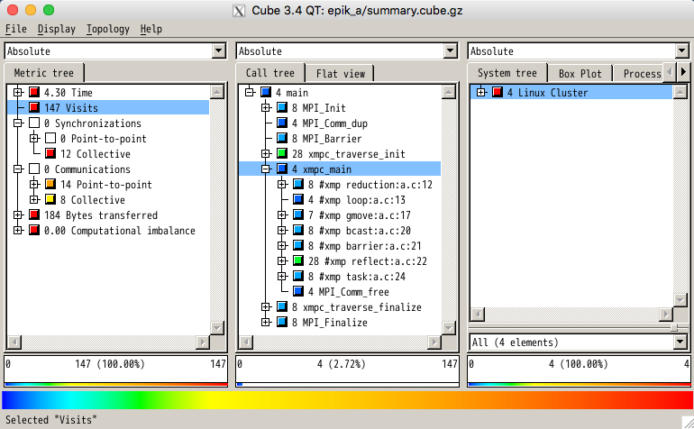
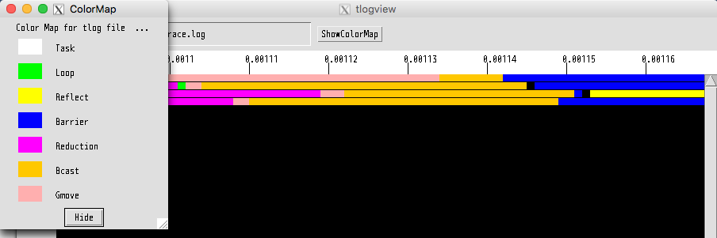

Tips
====================================

How to compile one part of code by a native compiler 
-------------------------------------------------------
You can link object files generated by a native compiler and those by Omni Compiler. 
However, the restrictions are as follows. 

C language
^^^^^^^^^^^^^
For example, assume you have ``a.c`` and ``b.c``. 
If you want to compile ``a.c`` by the native compiler ``mpicc`` and you want to compile ``b.c`` by Omni Compiler ``xmpcc``, 
you can compile them individually. 
Note that you need to use Omni Compiler to link the object files. 

.. code-block:: bash

    $ mpicc a.c -c
    $ xmpcc b.c -c
    $ xmpcc a.o b.o

Fortran
^^^^^^^^^^^^^^^^
While the process is basically the same as with the C language,
there is an additional restriction for using a module file.
Omni Compiler uses an ``.xmod`` file, which is a particular file for using a module file.
Therefore, for example, 
even to generate a normal ``.mod`` file by gfortran, the ``.mod`` file cannot be used in Omni Compiler.

In order to transform a ``.mod`` file to an ``.xmod`` file, 
Omni Compiler provides a ``T_Module`` command. 
The ``T_Module`` command supports the ``.mod`` file generated by gfortran-4.4, 4.7, and 4.9. 

In order to build the ``T_Module`` command, 
you add the ``--enable-mod2xmod`` option to ``./configure``. 
Note that the build process of ``T_Module`` needs  `mpfr <http://www.mpfr.org/>`_ and `gmp <https://gmplib.org>`_.

.. code-block:: bash

    $ ./configure --enable-mod2xmod

For example, to generate ``test.xmod`` from ``test.mod``, you execute as follows. 

.. code-block:: bash

    $ T_module test.mod

How to call an XMP program from an MPI program
------------------------------------------------
Please insert the xmp_init() and xmp_finalize() defined by Omni Compiler to an MPI program.
The MPI communicator indicated in xmp_init() is used in an XMP program.

.. code-block:: C

    #include "xmp.h"
    
    int main(int argc, char **argv)
    {
      MPI_Init(&argc, &argv);
      xmp_init(MPI_COMM_WORLD);
      foo();   // foo() is an XMP program
      xmp_finalize();
      MPI_Finalize();
    
      return 0;
    }

.. code-block:: Fortran

    program test
      include 'mpif.h'
      integer ierror
    
      call MPI_INIT(ierror)
      call xmp_init(MPI_COMM_WORLD)
      call foo()  ! foo is an XMP program
      call xmp_finalize()
      call MPI_FINALIZE(ierror)
    end program test

Please use an MPI compiler for MPI programs, and the Omni XMP compiler for XMP programs.
Finally, please link object files by the Omni XMP compiler.

.. code-block:: bash

    $ mpicc mpi.c -c
    $ xmpcc xmp.c -c
    $ xmpcc mpi.o xmp.o

In the case of failure of installation 
---------------------------------------
Confirm PATH of MPI
^^^^^^^^^^^^^^^^^^^^
Confirm the setting of ``PATH``, which is set to MPI commands by using the ``which`` command. 
The following is an example case in which you installed OpenMPI by the ``aptitude`` command in Debian GNU/Linux 8.3. 

.. code-block:: bash

    % which mpicc
    /usr/bin/mpicc

If ``PATH`` is not set to the MPI commands, 
the ``which`` command outputs no message.

When you installed OpenMPI by the ``yum`` command in CentOS 7, 
OpenMPI is installed in ``/usr/lib64/openmpi/``. 
Therefore, you need to set ``PATH`` manually as follows.

.. code-block:: bash

    $ export PATH=/usr/lib64/openmpi/bin:$PATH 

Note in the case of using GASNet except for mpi-conduit 
---------------------------------------------------------
When using GASNet except for mpi-conduit, 
GASNet is restricted to GASNet communication (coarray, post/wait/lock/unlock directives) and MPI communication (communication directives except for post/wait/lock/unlock directives, for example, the bcast directive) at the same time. 
If you want to know more details, 
please refer to "MPI Interoperability" of `README in GASNet <https://gasnet.lbl.gov/dist/README>`_ in detail).

Therefore, you cannot simultaneously use the two kinds of communication.
In particular, the ``xmp_sync_all()`` function in XcalableMP/C or the ``sync all`` statement in XcalableMP/Fortran is inserted after communication by GASNet. 
In a similar way, the ``barrier`` directive is inserted after communication by MPI. 

* XcalableMP/C

.. code-block:: c

    // use GASNet
    
    xmp_sync_all(&status)
    
    // use MPI
    
    #pragma xmp barrier
    
    // use GASNet

* XcalableMP/Fortran

.. code-block:: Fortran

    ! use GASNet
    
    sync all
    
    ! use MPI
    
    !$ xmp barrier
    
    ! use GASNet

Test programs for Omni Compiler
-------------------------------------
Omni Compiler prepares test programs to confirm whether Omni Compiler works properly. 
In order to compile and execute the test programs, 
you execute the following commands after installing Omni Compiler and setting ``PATH``. 

.. code-block:: bash

    $ make tests  // Compile test programs
    $ make run-tests  // Execute test programs
    $ make clean-tests // Delete binaries of test programs

The test programs are generated in the ``./test`` directory by the ``make tests`` command, 
and the test programs by the ``make run-tests`` command execute on a local node. 
Therefore, when you use a cross-compiler, 
you cannot execute the test programs by the ``make run-tests`` command. 
If you want to execute the test programs by using a cross-compiler, 
you need to execute them on a compute node manually.

Cooperation with profiling tools
---------------------------------
Omni Compiler has a function to cooperate with profiling tools, 
Scalasca (we confirmed it works with Scalasca version 1.4.3) and tlog. 
The function is available to measure time and so on of the following directives. 
At the present time, the function supports only XcalableMP/C. 

* loop
* reduction
* gmove
* bcast
* reflect
* barrier
* task

Profiling using Scalasca
^^^^^^^^^^^^^^^^^^^^^^^^^^^^^^^^^^^
First, you install Scalasca, and set ``PATH`` to the installed Scalasca. 

If you want to profile all directives that exist in a code, 
you add the ``--profile scalasca`` option to the compile command. 

.. code-block:: bash

    $ xmpcc --profile scalasca a.c

If you want to profile selected directives that exist in a code, 
you add the ``profile`` clause to the directive and you add the ``--selective-profile scalasca`` option to the compile command. 

.. code-block:: C

    #pragma xmp bcast (a) profile

.. code-block:: bash

    $ xmpcc --selective-profile scalasca a.c

For more information about Scalasca, please refer to the `Scalasca official site <http://www.scalasca.org>`_.

Profiling using tlog
^^^^^^^^^^^^^^^^^^^^^^^^^^^^^^
The tlog is automatically installed when installing Omni Compiler. 

If you want to profile all directives that exist in a code, 
you add the ``--profile tlog`` option to the compile command. 

.. code-block:: bash

    $ xmpcc --profile tlog a.c

If you want to profile selected directives that exist in a code, 
you add the ``profile`` clause to the directive and you add the ``--selective-profile tlog`` option to the compile command. 

.. code-block:: C

    #pragma xmp bcast (a) profile

.. code-block:: bash

    $ xmpcc --selective-profile tlog a.c

After executing a program, 
``trace.log`` is generated to save the profiling results. 
When you open the result, you use the ``tlogview`` command. 

.. code-block:: bash

    $ tlogview trace.log

How to use XMP Python package
------------------------------
You can call an XMP program from a Python program.
Now, this feature supports only an XMP C language.

Installation of Omni Compiler
^^^^^^^^^^^^^^^^^^^^^^^^^^^^^
``--enable-shared`` is used to create XMP shared library.

.. code-block:: bash

    $ ./configure --enable-shared --prefix=(INSTALL PATH)

``(INSTALL PATH)`` indicates the place where Omni Compiler is installed.

Example of XMP program
^^^^^^^^^^^^^^^^^^^^^^^^
.. code-block:: C

    // test.c
    #include <stdio.h>
    #include <xmp.h>
    #pragma xmp nodes p[*]
    
    void hello0(){
      printf("Hello 0 on node p[%d]\n", xmp_node_num());
    }
    
    void hello1(long a[3]){
      printf("Hello 1 on node p[%d]\n", xmp_node_num());
    }
    
    void hello2(long a[3], long b[2]){
      printf("Hello 2 on node p[%d]\n", xmp_node_num());
    }

Call XMP program from Python program
^^^^^^^^^^^^^^^^^^^^^^^^^^^^^^^^^^^^^^^^^^^^^^^^^^^^
In Python program, mpi4py and xmp packages are used.

.. code-block:: python

    # test.py
    import xmp
    from mpi4py import MPI
    
    lib  = xmp.Lib("test.so")
    job0 = lib.call(MPI.COMM_WORLD, "hello0")
    job1 = lib.call(MPI.COMM_WORLD, "hello1", [1,2,3])
    job2 = lib.call(MPI.COMM_WORLD, "hello2", ([1,2,3], [4,5]))

The call method calls an XMP program in parallel.
In the call method,
the 1st argument is an MPI communicator which is used as a node set in XMP program.
The 2nd argument is the function name in XMP program.
The 3rd argument is arguments for the XMP program.
If you want to indicate multiple arguments, you should use a tuple.

Spawn XMP program from Python program
^^^^^^^^^^^^^^^^^^^^^^^^^^^^^^^^^^^^^^^^^^^^^^^^^^^^^

.. code-block:: python

    import xmp
    
    lib = xmp.Lib("test.so")
    job0 = lib.spawn(4, "hello0")
    job1 = lib.spawn(4, "hello1", [1,2,3])
    job2 = lib.spawn(4, "hello2", ([1,2,3], [4,5,6]), async=True)
    job2.wait()

The spawn method spawns an XMP program.
In the spawn method,
the 1st argument is the number of processes, XMP program is executed in the number of processes.
The 2nd argument is the function name in XMP program.
The 3rd argument is arguments for the XMP program.
If you want to indicate multiple arguments, you should use a tuple.
When "async=True" is indicated additionally,
the XMP program is executed asynchronously.
The wait method waits to finish the XMP program.

Creation of shared library of XMP program
------------------------------------------
Shared library option depends on a native compiler. In gcc, the option is ``-fPIC -shared``.

.. code-block:: bash

    $ xmpcc -fPIC -shared test.c -o test.so

Before execution, you need to set path to XMP Python package using a Python environment variable ``PYTHONPATH`` and set path to XMP shared library using an environment variable ``LD_LIBRARY_PATH``.

.. code-block:: bash

    $ export PYTHONPATH=(INSTALL PATH)/lib
    $ export LD_LIBRARY_PATH=(INSTALL PATH)/lib:$LD_LIBRARY_PATH
    $ mpirun -np 2 python ./test.py

