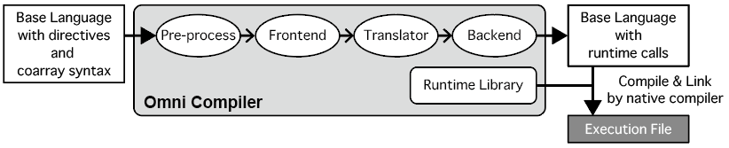

=========================
Omni Compilerとは
=========================
Omni Compilerは， `XcalableMP <http://xcalablemp.org>`_ ， `XcalableACC <http://xcalablemp.org/XACC.html>`_ ， `OpenACC <http://www.openacc.org>`_ といった指示文を含むコードを対象としたコンパイラである．対応しているベース言語は，XcalableMPはC言語（C99）およびFortran 2008，XcalableACCとOpenACCはC言語（C99）である．

Omni Compilerはsource-to-sourceコンパイラの一種であり，ベース言語と各指示文で記述されたコードを，Omni Compilerが提供するランタイムの呼び出しを含むコードに変換する．Omni Compilerの内部では，XML表現の中間コードである `XcodeML <http://omni-compiler.org/xcodeml.html>`_ を用いて，コードの解析などを行っている．下記に，Omni Compilerの動作の流れを示す．

Omni Compilerは，最終的にネイティブコンパイラ（ ``mpicc`` や ``nvcc`` コマンドなど）を用いて，ランタイムの呼び出しに変換されたコードをコンパイルし，実行ファイルを生成する．Omni Compilerが提供するランタイムは，XcalableMPではMPI，OpenACCではCUDA，XcalableACCではMPIとCUDAの両方を用いている．

XcalableMPにおいては，MPIと他の片側通信ライブラリとを併用することにより，より高速なランタイムを生成できる場合がある．詳細は :doc:`install` の「XcalableMPにおける他の片側通信ライブラリの利用」に記載している．
