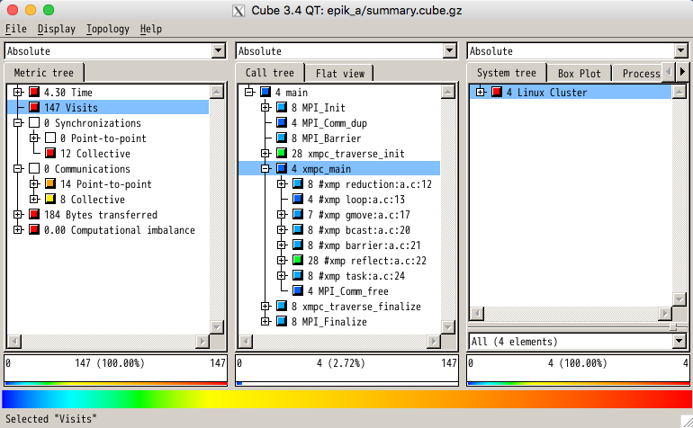
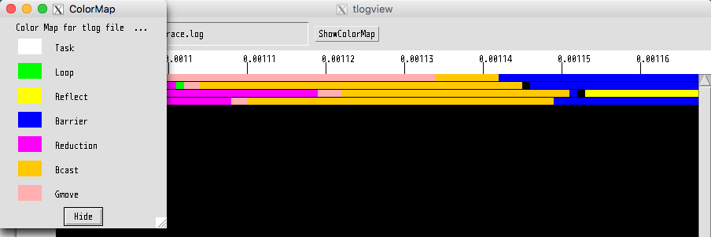

Tips
====================================

一部のコードをネイティブコンパイラでコンパイルする場合
-------------------------------------------------------
ネイティブコンパイラで作成したオブジェクトファイルとOmni Compilerで作成したオブジェクトファイルとはリンクすることが可能である．ただし，下記の制限がある．

C言語の場合
^^^^^^^^^^^^^
例えば  ``a.c`` と ``b.c`` という2つのコードがあり， ``a.c`` はネイティブコンパイラ（ここでは ``mpicc`` ）を用いて， ``b.c`` はOmni Compiler（ここでは ``xmpcc`` ）を用いてコンパイルしたい場合は，下記のように個別に行うことが可能である．ただし，リンクには必ずOmni Compilerを利用する必要がある．

.. code-block:: bash

    $ mpicc a.c -c
    $ xmpcc b.c -c
    $ xmpcc a.o b.o

Fortranの場合
^^^^^^^^^^^^^^^^
基本的にはC言語と同様であるが，モジュールの利用についてのみ注意が必要になる．Omni Compilerでは， ``.xmod`` ファイルという特殊なファイルを使って，モジュールの利用を行っている．そのため，例えばgfortranを使って通常の ``.mod`` ファイルを作成しても，その ``.mod`` ファイルはOmni Compilerからは利用することはできない．

そこで，Omni Compilerは ``.mod`` ファイルを ``.xmod`` ファイルに変換するコマンド ``T_Module`` を提供している． ``T_Module`` はgfortran-4.4, 4.7, 4.9が作成した ``.mod`` ファイルの変換に対応している．

``./configure`` に ``--enable-mod2xmod`` オプションをつけることで， ``T_Module`` がOmni Compilerと同時にビルドされる．なお， ``T_Module`` のビルドには， `mpfr <http://www.mpfr.org/>`_ と `gmp <https://gmplib.org>`_ が必要である．

.. code-block:: bash

    $ ./configure --enable-mod2xmod

例えば， ``test.mod`` を ``test.xmod`` というOmni Compiler用のモジュールファイルに変換する場合，下記のように実行する．

.. code-block:: bash

    $ T_module test.mod

MPIプログラムからXMPプログラムを呼び出す方法
----------------------------------------------
Omni Compilerが用意している関数xmp_init()とxmp_finalize()をMPIプログラムに挿入する．xmp_initの引数で指定したMPIコミュニケータで，XMPプログラムは動作する．

.. code-block:: C

    #include "xmp.h"
    
    int main(int argc, char **argv)
    {
      MPI_Init(&argc, &argv);
      xmp_init(MPI_COMM_WORLD);
      foo();   // foo() is an XMP program
      xmp_finalize();
      MPI_Finalize();
    
      return 0;
    }

.. code-block:: Fortran

    program test
      include 'mpif.h'
      integer ierror
    
      call MPI_INIT(ierror)
      call xmp_init(MPI_COMM_WORLD)
      call foo()  ! foo is an XMP program
      call xmp_finalize()
      call MPI_FINALIZE(ierror)
    end program test

MPIプログラムはMPIコンパイラでコンパイルし，XMPプログラムはXMPコンパイラでコンパイルする．リンカにはXMPコンパイラを利用する．

.. code-block:: bash

    $ mpicc mpi.c -c
    $ xmpcc xmp.c -c
    $ xmpcc mpi.o xmp.o

インストールが失敗する場合
---------------------------
MPIへのPATHの確認
^^^^^^^^^^^^^^^^^^^
``which`` コマンドを使って，MPIへの ``PATH`` が設定されているかを確認する．下記はDebian GNU/Linux 8.3においてOpenMPIを ``aptitude`` コマンドでインストールした場合の例である．

.. code-block:: bash

    % which mpicc
    /usr/bin/mpicc

もし，MPIへの ``PATH`` が設定されていなければ， ``which`` コマンドは何も出力しない．

なお，CentOS 7においてOpenMPIを ``yum`` でインストールした場合，OpenMPIは ``/usr/lib64/openmpi/`` にインストールされる．そのため，手動で下記のように ``PATH`` を設定する必要がある．

.. code-block:: bash

    $ export PATH=/usr/lib64/openmpi/bin:$PATH 

mpi-conduit以外のGASNetを用いた場合の注意点
----------------------------------------------
mpi-conduit以外のGASNetを用いる場合，GASNetの制約（詳細は `GASNetのREADME <https://gasnet.lbl.gov/dist/README>`_ の"MPI Interoperability"を参照）のため，GASNetによる通信（Coarray，post/wait/lock/unlock指示文）とMPIによる通信（post/wait/lock/unlock指示文以外の通信指示文．例えば，bcast指示文など）がネットワーク上で同時に発生することは許していない．

そのため，GASNetとMPIの2種類の通信が同時に発生しないようにする必要がある．具体的には，GASNetによる通信の後に，XcalableMP/Cの場合は関数 ``xmp_sync_all()`` ，XcalableMP/Fortranの場合は ``sync all`` 文を挿入する．同様にMPIによる通信の後は， ``barrier`` 指示文を挿入する．

* XcalableMP/C

.. code-block:: c

    // (GASNetによる通信)
    
    xmp_sync_all(&status)
    
    // (MPIによる通信)
    
    #pragma xmp barrier
    
    // (GASNetによる通信)

* XcalableMP/Fortran

.. code-block:: Fortran

    ! (GASNetによる通信)
    
    sync all
    
    ! (MPIによる通信)
    
    !$ xmp barrier
    
    ! (GASNetによる通信)

Omni Compilerのテスト
-----------------------
omnni compilerでは，Omni Compilerが正常に動作するかを確かめるためのテストプログラムを用意している．テストプログラムのコンパイルと実行には，Omni Compilerのインストールおよび ``PATH`` の設定後に下記のコマンドを実行する．

.. code-block:: bash

    $ make tests  // テストプログラムのコンパイル
    $ make run-tests  // テストプログラムの実行
    $ make clean-tests // テストプログラムのバイナリの削除

``make tests`` コマンドは， ``./test`` ディレクトリ以下にテストプログラムを生成する． ``make run-tests`` コマンドによるテストプログラムの実行はローカルノードで行われるため，クロスコンパイラを用いている場合は ``make run-tests`` コマンドによるテストプログラムの実行を行うことはできない．クロスコンパイラを用いている場合でテストの実行を行いたい場合は， ``./test`` ディレクトリ以下のテストプログラムに対してユーザが直接計算ノードで実行を行う必要がある．

プロファイリングツールとの連携
--------------------------------
Omni Compilerには，プロファイリングツールであるScalasca（version 1.4.3で動作確認）およびtlogとの連携機能がある．本機能は，XcalableMPの下記指示文の実行に要する時間などを計測することができる．本機能は現時点ではXcalableMP/Cのみの対応である．

* loop
* reduction
* gmove
* bcast
* reflect
* barrier
* task

Scalascaを用いたプロファイリング
^^^^^^^^^^^^^^^^^^^^^^^^^^^^^^^^^^^
まずScalascaをインストールし，Scalacaへの ``PATH`` を設定する．

コードに存在するすべての指示文についてプロファイリングをとりたい場合は，``--profile scalasca`` オプションをつけてコンパイルを行い，実行する．

.. code-block:: bash

    $ xmpcc --profile scalasca a.c

特定の指示文にのみプロファイルをとりたい場合は，その指示文に ``profile`` という節を追加し， ``--selective-profile scalasca`` オプションをつけてコンパイルを行い，実行する．

.. code-block:: C

    #pragma xmp bcast (a) profile

.. code-block:: bash

    $ xmpcc --selective-profile scalasca a.c

Scalascaを用いたプロファイリング方法の詳細は `Scalascaの公式サイト <http://www.scalasca.org>`_ を参考のこと．

tlogを用いたプロファイリング
^^^^^^^^^^^^^^^^^^^^^^^^^^^^^^
tlogはOmni Compilerのインストール時に自動的にインストールされる．

コードに存在するすべての指示文についてプロファイリングをとりたい場合は， ``--profile tlog`` オプションをつけてコンパイルを行い，実行する．

.. code-block:: bash

    $ xmpcc --profile tlog a.c

特定の指示文にのみプロファイルをとりたい場合は，その指示文に ``profile`` という節を追加し， ``--selective-profile tlog`` オプションをつけてコンパイルを行い，実行する．

.. code-block:: C

    #pragma xmp bcast (a) profile

.. code-block:: bash

    $ xmpcc --selective-profile tlog a.c

プログラム実行後に， ``trace.log`` というプロファイル結果が保存されたファイルが生成される．プロファイル結果を閲覧する場合は， ``tlogview`` コマンドを用いる．

.. code-block:: bash

    $ tlogview trace.log

XMP Pythonパッケージの使い方
-----------------------------
PythonプログラムからXMPプログラムを呼び出すことができる．現時点ではXMPプログラムはC言語のみの対応である．

Omni Compilerのインストール
^^^^^^^^^^^^^^^^^^^^^^^^^^^^^
``--enable-shared`` オプションをつけ，XMPの共有ライブラリを生成する．
``(INSTALL PATH)`` には，インストール先を指定する．

.. code-block:: bash

    $ ./configure --enable-shared --prefix=(INSTALL PATH)

XMPプログラムの例
^^^^^^^^^^^^^^^^^^
.. code-block:: C

    // test.c
    #include <stdio.h>
    #include <xmp.h>
    #pragma xmp nodes p[*]
    
    void hello0(){
      printf("Hello 0 on node p[%d]\n", xmp_node_num());
    }
    
    void hello1(long a[3]){
      printf("Hello 1 on node p[%d]\n", xmp_node_num());
    }
    
    void hello2(long a[3], long b[2]){
      printf("Hello 2 on node p[%d]\n", xmp_node_num());
    }

PythonプログラムからXMPプログラムをコールする場合
^^^^^^^^^^^^^^^^^^^^^^^^^^^^^^^^^^^^^^^^^^^^^^^^^^^^
Pythonプログラムでは，xmpおよびmpi4pyパッケージを用いる．

.. code-block:: python

    # test.py
    import xmp
    from mpi4py import MPI
    
    lib  = xmp.Lib("test.so")
    job0 = lib.call(MPI.COMM_WORLD, "hello0")
    job1 = lib.call(MPI.COMM_WORLD, "hello1", [1,2,3])
    job2 = lib.call(MPI.COMM_WORLD, "hello2", ([1,2,3], [4,5]))

callメソッドは指定したXMPプログラムを並列実行させる．第1引数はMPIコミュニケータであり，これはXMPプログラムのnode setとして用いられる．第2引数はXMPプログラムの関数名である．第3引数はXMPプログラムに渡される引数である（省略可能）．もし複数の引数を渡したいときはタプルを用いる．

PythonプログラムからXMPプログラムをスポーンする場合
^^^^^^^^^^^^^^^^^^^^^^^^^^^^^^^^^^^^^^^^^^^^^^^^^^^^^

.. code-block:: python

    import xmp
    
    lib = xmp.Lib("test.so")
    job0 = lib.spawn(4, "hello0")
    job1 = lib.spawn(4, "hello1", [1,2,3])
    job2 = lib.spawn(4, "hello2", ([1,2,3], [4,5,6]), async=True)
    job2.wait()

spawnメソッドは指定したXMPプログラムをスポーンさせる．第1引数はプロセス数であり，この並列数でXMPプログラムは起動する．第2引数はXMPプログラムの関数名である．第3引数はXMPプログラムに渡される引数である（省略可能）．もし複数の引数を渡したいときはタプルを用いる．さらにasync=Trueが指定された場合は，XMPプログラムは非同期で実行される．waitメソッドで非同期実行しているXMPプログラムの終了を待つ．

XMPプログラムの共有ライブラリの生成
-------------------------------------
共有ライブラリの生成オプションはネイティブコンパイラに依存する．gccの場合は ``-fPIC -shared`` である．

.. code-block:: bash

    $ xmpcc -fPIC -shared test.c -o test.so

Pythonの環境変数 ``PYTHONPATH`` を用いて，XMPのPythonパッケージへのPATHを指定する．また，環境変数 ``LD_LIBRARY_PATH`` を用いて，XMPの共有ライブラリへのPATHを指定する．

.. code-block:: bash

    $ export PYTHONPATH=(INSTALL PATH)/lib
    $ export LD_LIBRARY_PATH=(INSTALL PATH)/lib:$LD_LIBRARY_PATH
    $ mpirun -np 2 python ./test.py

